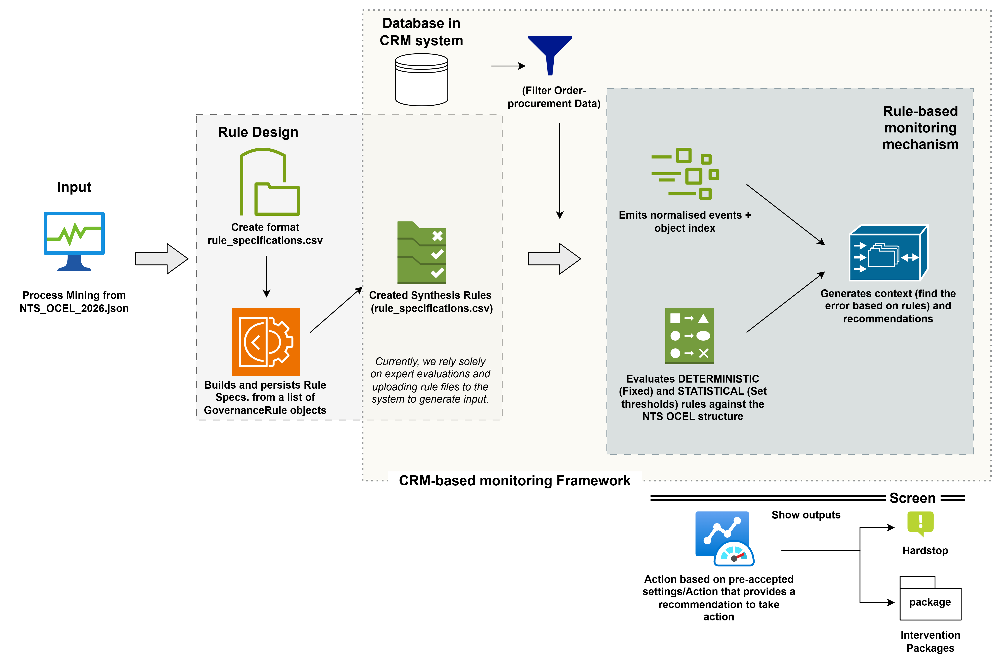

# CRM-Based Monitoring Framework

This GitHub repository accompanies the practical thesis titled "Improving Inter-departmental Monitoring and Governance of Operational Documents through a CRM-based framework" following Design Science Research (DSR) principles. In this study, the rule-based monitoring mechanism was designed, built, and developed based on three components, respectively, using simulated data from Nam Truong Son JSC's internal documents and CRM system. The chosen framework adhered to the OCEL 2.0 standard format for artificial intelligence development and evaluation.

---

## Overall pipeline

## 

## Prerequisites

- Python 3.12+
- pip

---

## Initial setup (Installation)

To use the rule-based monitoring development and evaluation framework, the study follow the basic environment setup instructions below. So, it is especially important to ensure that the necessary information in the config.py file and corresponding scripts is up-to-date.

```bash
# 1. Clone or extract the project
cd crm_monitoring

# 2. (Optional but recommended) Create a virtual environment
python3 -m venv .venv
source .venv/bin/activate          # Linux / macOS
.venv\Scripts\activate             # Windows

# 3. Install dependencies
pip install -r requirements.txt
```

---

## Data preparation

- Source Materials

Internal documents are used as the basis for building the database: BPMN workflow in CRM, Internal process documents, Business requirements, Operating procedures,Prompt Construction

- Prompt Construction
  Prompt templates built to reflect: document flow, activities, departments, business objects, relationships

- Base Dataset
  Dataset schema sample: order-management.json

sources: https://www.ocel-standard.org/event-logs/simulations/order-management/

Synthetic Dataset Generation

Inputs:

Path: data/dataset_preparing/Data/Order-procuments/..
inputs/
│
├── Internal documents
├── Prompt templates
└── order-management.json

Output:

outputs/
└── NTS_OCEL_2026.json

NTS_OCEL_2026 was used as the official dataset for the entire experimental process.

---

## Running the Framework

### Development and evaluation framework

The implementation follows the CRM-Based Monitoring Framework proposed in the thesis.

The framework consists of:

- Rule Design Instance
- Monitoring Instance
- Evaluation Instance


```bash
python main.py
```

This runs all three instances in sequence and writes the following files to `output/`:

| File                        | Description                                            |
| --------------------------- | ------------------------------------------------------ |
| `rule_repository.csv`       | Persisted rule repository with all 15 governance rules |
| `detected_violations.csv`   | All detected violations (deterministic + statistical)  |
| `intervention_packages.csv` | Managerial intervention packages (Critical-level only) |
| `confusion_matrix.csv`      | Per-rule TP/FP/FN/TN counts                            |
| `evaluation_results.csv`    | Precision / Recall / F1-score per rule and overall     |
| `framework.log`             | Full execution log                                     |

### Custom paths

```bash
python main.py \
  --rule-spec  data/rule_specification.csv \
  --ocel       data/dataset_simulation/Data/Order_procurement/outputs/NTS_OCEL_2026.json \
  --ground-truth data/ground_truth.csv \
  --output-dir output/
```

### Skip evaluation

```bash
python main.py --skip-evaluation
```

---

## Rule Types

### Deterministic Rules (Fixed threshold)

| Rule ID | Name                            | Response             |
| ------- | ------------------------------- | -------------------- |
| GR01    | Complete Information            | Hard Stop            |
| GR02    | Mandatory Document Validation   | Hard Stop            |
| GR04    | Ownership Assignment            | Hard Stop            |
| GR06    | Quotation Traceability          | Hard Stop            |
| GR09    | Rework Justification            | Hard Stop            |
| GR11    | Version Consistency             | Intervention Package |
| GR12    | Document Lineage Control        | Hard Stop            |
| GR13    | Traceability Completeness       | Intervention Package |
| GR15    | Ownership Governance Monitoring | Intervention Package |

### Statistical Rules (P90/P95 calibration)

| Rule ID | Name                              | Metric                            |
| ------- | --------------------------------- | --------------------------------- |
| GR03    | Communication Traceability        | Non-standard comm count per PO    |
| GR05    | Vendor Communication Traceability | Vendor non-standard channel count |
| GR07    | Negotiation Auditability          | Undocumented revision count       |
| GR08    | BOM Rework Control                | Validation cycle count            |
| GR10    | Master Data Consistency           | Naming inconsistency count        |
| GR14    | Operational Timeliness Monitoring | Days to shipment update           |

---

## Threshold Configuration

| Threshold | Percentile | Purpose                                        |
| --------- | ---------- | ---------------------------------------------- |
| Warning   | P90        | Logged to violation log; no package generated  |
| Critical  | P95        | Violation log + Intervention Package generated |

Thresholds are derived automatically from the historical OCEL event log.

---

## Managerial Principle

The framework **never** makes autonomous business decisions. It only:

- Detects deviations
- Generates operational context
- Proposes recommendations
- Forwards Intervention Packages

**Final decisions always belong to managers.**

---

## Output Samples

### detected_violations.csv

```
violation_id,rule_id,rule_name,rule_type,object_id,severity,response_mode,condition_met,...
VIO-DET-0001,GR01,Complete Information,Deterministic,PO-NTS-2026-002,High,Hard Stop,...
```

### intervention_packages.csv

```
package_id,po_id,rule_id,severity,triggered_metric,threshold_level,observed_value,...
IP-0001,PO-NTS-2026-002,GR03,Medium,non_standard_comm_count,Critical,1.0,...
```

### evaluation_results.csv

```
scope,tp,fp,fn,tn,precision,recall,f1_score
GR01,...
GR03,...
OVERALL,...
```

---

## Results

### Deterministic Rules

Experimental results show that the rules in the document integrity and traceability control group generally perform stably.

| Rule ID | TP  | FP  | FN  | Precision | Recall | F1-score | Interpretation                                   |
| ------- | --- | --- | --- | --------- | ------ | -------- | ------------------------------------------------ |
| DG01    | 8   | 2   | 0   | 0.800     | 1.000  | 0.889    | Missing notes field caused minor false positives |
| DG02    | N/A | N/A | N/A | N/A       | N/A    | N/A      | Attachment information unavailable               |
| DG04    | N/A | N/A | N/A | N/A       | N/A    | N/A      | Ownership information unavailable                |
| DG06    | N/A | N/A | N/A | N/A       | N/A    | N/A      | No violations observed                           |
| DG09    | N/A | N/A | N/A | N/A       | N/A    | N/A      | No ground truth available for evaluation         |
| DG11    | N/A | N/A | N/A | N/A       | N/A    | N/A      | Version metadata unavailable                     |
| DG12    | N/A | N/A | N/A | N/A       | N/A    | N/A      | Upstream reference unavailable                   |
| DG13    | 46  | 4   | 0   | 0.920     | 1.000  | 0.958    | Strong lifecycle traceability detection          |
| DG15    | N/A | N/A | N/A | N/A       | N/A    | N/A      | Approval information unavailable                 |

In particular, DG01 and DG13 achieved high accuracy and detection capabilities, demonstrating that the monitoring mechanism can effectively identify issues related to information completeness and document traceability. Some rules could not be evaluated because the current dataset lacked the necessary metadata or corresponding violations were not observed.

### Statistical Rules

| Rule ID | TP  | FP  | FN  | Precision | Recall | F1-score | Interpretation                                   |
| ------- | --- | --- | --- | --------- | ------ | -------- | ------------------------------------------------ |
| DG03    | 5   | 0   | 10  | 1.000     | 0.333  | 0.500    | Conservative threshold, low recall               |
| DG05    | 11  | 0   | 2   | 1.000     | 0.846  | 0.917    | Effective vendor communication anomaly detection |
| DG07    | 11  | 1   | 1   | 0.917     | 0.917  | 0.917    | Reliable BOM cycle detection                     |
| DG08    | 8   | 0   | 3   | 1.000     | 0.727  | 0.842    | Good rework detection                            |
| DG10    | 6   | 1   | 0   | 0.857     | 1.000  | 0.923    | Strong naming inconsistency detection            |
| DG14    | 5   | 5   | 1   | 0.500     | 0.833  | 0.625    | Delay detection sensitive to threshold settings  |

Rules related to monitoring operational behavior and process performance yielded positive results, with most F1 scores exceeding 0.8. Mechanisms for detecting anomalies in vendor communication, BOM loops, and data inconsistencies performed well.
However, results for some rules, such as DG03 and DG14, suggest that system sensitivity depends on statistical threshold adjustment, implying that thresholds may need further refinement during real-world implementation.

### Overall Performance

| Metric                     | Value |
| -------------------------- | ----- |
| True Positives (TP)        | 100   |
| False Positives (FP)       | 13    |
| False Negatives (FN)       | 17    |
| Precision                  | 0.885 |
| Recall                     | 0.855 |
| F1-score                   | 0.870 |
| Number of events           | 1,008 |
| Number of purchase orders  | 50    |
| Number of governance rules | 15    |

These results indicate that the system is capable of detecting most governance violations with an acceptable false alarm rate. Rules related to document traceability, BOM lifecycle, and vendor communication performed particularly well, while some rules could not be fully evaluated due to metadata limitations in the experimental dataset.

### Evaluation overall

Experimental results show that the proposed CRM-Based Monitoring Framework is capable of transforming document management requirements into enforceable monitoring mechanisms. The system not only supports early detection of violations in the order management process but also enhances traceability, transparency, and operational control. With an overall F1-score of 0.870, the framework demonstrates the feasibility of a rule-based monitoring approach in improving business document management on a CRM platform without altering the existing core system architecture.

---

## Project Structure

```
crm_monitoring/
├── src/
│   ├── rule_design/
│   │   ├── rule_loader.py                         # Load rule_specification.csv
│   │   ├── rule_repository_builder.py             # Build in-memory Rule Repository
│   │   └── run_rule_design.py                     # Rule Design Instance entry point
│   ├── monitoring/
│   │   ├── event_stream_processor.py              # Parse & stream OCEL events
│   │   ├── rule_engine.py                         # Evaluate deterministic rules
│   │   ├── threshold_engine.py                    # Calibrate & evaluate statistical rules
│   │   ├── operational_context_enforcement_engine.py  # Enforce response modes
│   │   └── run_monitoring.py                      # Monitoring Instance entry point
│   └── evaluation/
│       ├── evaluation_data_loader.py              # Load ground truth & detections
│       ├── confusion_matrix.py                    # Compute TP/FP/FN/TN
│       ├── metrics.py                             # Precision, Recall, F1-score
│       └── run_evaluation.py                      # Evaluation Instance entry point
├── data/
│   ├── dataset_simulation/Data/Order_procurement/outputs/NTS_OCEL_2026.json  # OCEL event log (input)
│   ├── rule_specification.csv                     # Governance rules (input)
│   └── ground_truth.csv                           # Manual violations (input)
├── output/                                        # All generated outputs land here
├── development_framework.png
├── e2e_pipeline.png
├── main.py                                        # Top-level runner
├── requirements.txt
└── README.md
```

---

## Architecture

```
INPUTS
  rule_specification.csv  ──►  RULE DESIGN INSTANCE
  NTS_OCEL_2026.json      ──►  MONITORING INSTANCE
  ground_truth.csv        ──►  EVALUATION INSTANCE

RULE DESIGN INSTANCE
  rule_loader.py               → Load & validate rules
  rule_repository_builder.py   → Build indexed repository
  Output: rule_specifications.csv

        ↓ (Rule Specification File)

MONITORING INSTANCE
  event_stream_processor.py              → Parse & stream OCEL events
  rule_engine.py                         → Evaluate deterministic rules (GR01,02,04,06,09,11,12,13,15)
  threshold_engine.py                    → Calibrate P90/P95 + evaluate statistical rules (GR03,05,07,08,10,14)
  (Stored into Rule Repository of CRM database)
  operational_context_enforcement_engine.py → Enforce response modes
  Output: detected_violations.csv, intervention_packages.csv

        ↓ (Detected Violations)

EVALUATION INSTANCE
  evaluation_data_loader.py  → Load & align ground truth vs detected
  confusion_matrix.py        → Compute TP/FP/FN/TN
  metrics.py                 → Precision / Recall / F1-score
  Output: confusion_matrix.csv, evaluation_results.csv
```

---

## Conclusion

The repository demonstrates the implementation of a CRM-Based Monitoring Framework for document governance in the internal order management process.

The generated artifacts support the empirical findings and evaluation reported in the thesis.
